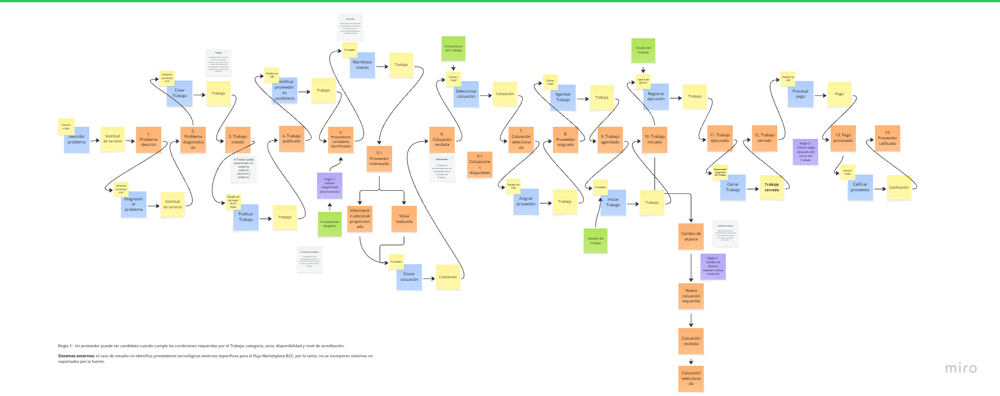

# EventStorming AS-IS — Servicios para el hogar

## 1. Objetivo

Documentar mediante EventStorming el flujo actual (AS-IS) de gestión de trabajos de Hogar de los Alpes, identificando los principales eventos, comandos, actores, agregaciones, modelos de lectura, sistemas externos y definiciones del dominio.

## 2. Flujo AS-IS

El flujo representa el ciclo de vida de un trabajo, desde la identificación del problema hasta su cierre, pago y calificación del proveedor.

### Diagrama EventStorming

---

## 3. Actores

| Actor | Participación en el flujo |
|---|---|
| Cliente / Hogar | Solicita el servicio, selecciona una cotización y participa en la gestión del trabajo. |
| Proveedor | Manifiesta interés, envía cotizaciones, ejecuta el trabajo y puede requerir cambios de alcance. |
| Plataforma Hogar de los Alpes | Gestiona el proceso de creación, publicación, cotización, asignación y seguimiento del trabajo. |

## 4. Comandos

| Comando | Actor |
|---|---|
| Describir problema | Cliente / Hogar |
| Diagnosticar problema | Asistente / Plataforma |
| Crear trabajo | Cliente / Hogar |
| Publicar trabajo | Plataforma |
| Identificar proveedores candidatos | Plataforma |
| Manifestar interés | Proveedor |
| Enviar cotización | Proveedor |
| Seleccionar cotización | Cliente / Hogar |
| Asignar proveedor | Plataforma |
| Agendar trabajo | Cliente / Hogar |
| Iniciar trabajo | Proveedor |
| Registrar ejecución | Proveedor |
| Procesar pago | Plataforma |
| Cerrar trabajo | Cliente / Hogar / Plataforma |
| Calificar proveedor | Cliente / Hogar |

## 5. Eventos de dominio

Los principales eventos identificados en el flujo AS-IS son:

- Problema descrito
- Problema diagnosticado
- Trabajo creado
- Trabajo publicado
- Proveedores candidatos identificados
- Proveedor interesado
- Cotización recibida
- Cotización seleccionada
- Proveedor asignado
- Trabajo agendado
- Trabajo iniciado
- Trabajo ejecutado
- Trabajo cerrado
- Pago procesado
- Proveedor calificado
- Cambio de alcance
- Nueva cotización requerida

## 6. Agregaciones

| Agregación | Responsabilidad |
|---|---|
| Trabajo | Representa la actividad solicitada y controla su ciclo de vida. |
| Cotización | Representa la propuesta realizada por un proveedor para ejecutar un trabajo. |
| Proveedor | Representa al tercero encargado de prestar el servicio. |
| Pago | Representa la gestión del pago asociado al trabajo. |

## 7. Modelo de lectura

| Modelo de lectura | Información |
|---|---|
| Trabajo | Estado, categoría, urgencia, ubicación, evidencia y datos del servicio. |
| Cotizaciones disponibles | Cotizaciones recibidas de los proveedores interesados. |
| Proveedor | Información y disponibilidad de proveedores candidatos. |
| Estado del trabajo | Información sobre agenda, ejecución, cierre y cambios de alcance. |

## 8. Sistemas externos

| Sistema externo | Participación |
|---|---|
| Plataforma Hogar de los Alpes | Interviene en la gestión del trabajo y comunicación con los actores. |
| Sistema de pagos | Permite procesar el pago asociado al trabajo. |

## 9. Definiciones principales

| Concepto | Definición |
|---|---|
| Trabajo | Actividad que debe ser realizada para resolver una necesidad del cliente. |
| Proveedor | Tercero que presta el servicio requerido. |
| Cotización | Propuesta económica y/o de servicio realizada por un proveedor. |
| Cambio de alcance | Modificación de las condiciones inicialmente definidas para el trabajo. |
| Calificación | Evaluación realizada sobre el proveedor después de finalizar el trabajo. |
