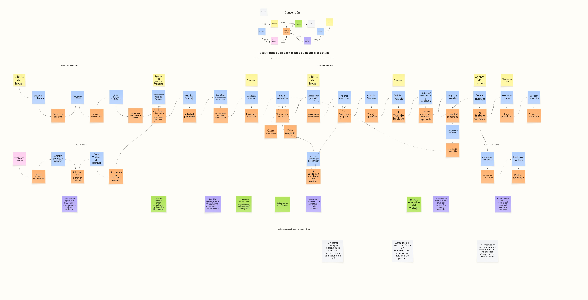

# EventStorming Big Picture AS-IS

## Propósito y alcance

El Big Picture AS-IS reconstruye el ciclo de vida actual del **Trabajo** dentro del monolito de Hogar de los Alpes (HdA). El análisis muestra dos entradas que convergen en un ciclo operacional compartido:

- **Marketplace B2C:** una necesidad expresada por el cliente del hogar se diagnostica y se convierte en un Trabajo de Marketplace.
- **B2B2C:** una aseguradora, banco o comercio envía una solicitud previamente aprobada y HdA crea el Trabajo de partner sujeto a las condiciones del acuerdo.

La aprobación inicial de cobertura ocurre en el sistema de la aseguradora. HdA recibe la solicitud y coordina la atención; no administra la póliza ni toma esa decisión externa.

El tablero es una reconstrucción lógica sustentada en el enunciado. No afirma que los comandos, eventos o módulos existan con esos nombres en el código real del monolito.

## Tablero

**Fuente:** [Hogar de los Alpes — EventStorming Big Picture AS-IS](https://miro.com/app/board/uXjVHwxwBQQ=/?share_link_id=146094024638)

## Lectura del flujo

### Entrada Marketplace B2C

El cliente del hogar describe el problema y la plataforma lo diagnostica antes de crear el Trabajo de Marketplace. A partir de allí se determina el flujo requerido, incluidos los subtrabajos, actividades y dependencias que correspondan.

### Entrada B2B2C

El partner registra una solicitud cuya atención ya fue aprobada externamente. HdA conserva los identificadores y restricciones recibidos y crea el Trabajo de partner. Cada acuerdo puede imponer red de proveedores, SLA, límites, aprobaciones posteriores, evidencia y condiciones de facturación particulares.

### Ciclo común del Trabajo

Las dos entradas convergen en un ciclo compuesto por:

1. Determinación del flujo del Trabajo.
2. Publicación e identificación de proveedores candidatos.
3. Manifestación de interés, información adicional o visita al predio.
4. Presentación y decisión sobre la Cotización.
5. Asignación y agendamiento del proveedor.
6. Inicio, ejecución y registro de evidencias.
7. Gestión de novedades, rediagnóstico, recotización o reasignación.
8. Cierre del Trabajo.

La decisión sobre una Cotización depende del canal: el cliente del hogar la selecciona en Marketplace; en B2B2C el partner puede aprobarla cuando el acuerdo lo exige.

### Consecuencias posteriores al cierre

- En Marketplace, el cierre habilita el procesamiento o liberación del pago y la calificación del proveedor.
- En B2B2C, el cierre exige consolidar las evidencias y facturar al partner de acuerdo con las condiciones comerciales.

## Hallazgos del AS-IS

- Trabajo, Proveedor y Partner comparten modelo y datos dentro del monolito, lo cual incrementa el acoplamiento entre capacidades.
- La verificación, la acreditación propia de HdA y la homologación exigida por un partner no siempre están claramente separadas.
- Más de 30 contratos externos convergen sobre la operación con diferencias de red, SLA, límites y auditoría.
- La coordinación de procesos largos depende de intervención humana y de mantener estados consistentes entre varias partes.
- Un cambio de alcance o categoría puede invalidar la Cotización, la agenda o el proveedor y exigir rediagnóstico, recotización o reasignación.
- El enunciado no permite confirmar los módulos, tablas ni mecanismos internos; estos elementos permanecen como puntos por validar.

## Convenciones y lenguaje

Los actores, comandos, eventos, políticas, modelos de lectura, sistemas externos y *hot spots* siguen las convenciones documentadas en el [lenguaje ubicuo](00-lenguaje-ubicuo.md). En particular:

- Los comandos expresan intención mediante un verbo en infinitivo.
- Los eventos expresan hechos del negocio en pasado.
- **Siniestro**, **Caso de partner** y **Trabajo** no son sinónimos.
- **Acreditación**, **Homologación** y **Elegibilidad** representan decisiones diferentes.
- Los elementos no confirmados se presentan como *hot spots* o interpretaciones, no como hechos del sistema actual.
