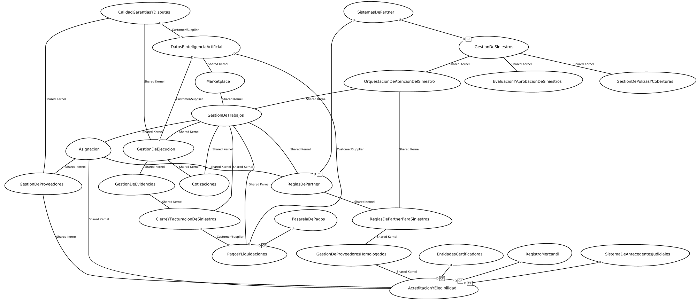
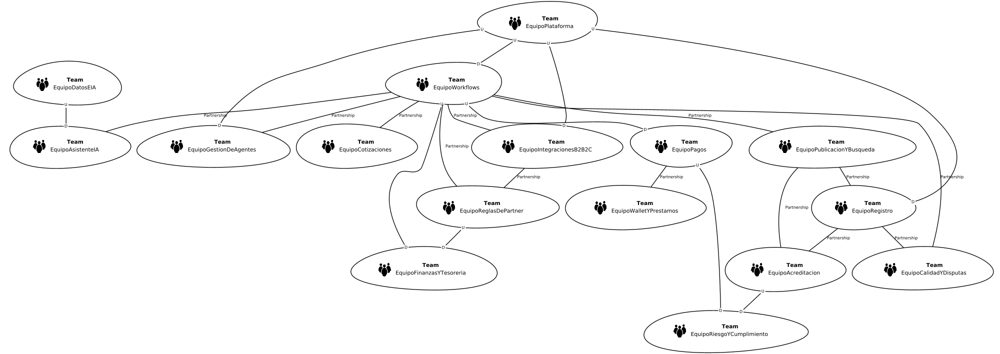

# Contextos acotados AS-IS

## 1. Cómo se modeló el AS-IS y por qué

Hoy Hogar de los Alpes se despliega como **un único monolito construido desde 2016**: una base de código, un esquema de base de datos, un ciclo de QA y despliegues de tres a cuatro horas. Desde el punto de vista técnico existe, por tanto, un solo artefacto.

Los límites se derivaron cruzando tres fuentes de evidencia:

| Fuente | Qué aporta |
|---|---|
| **Los subdominios AS-IS ya identificados por el equipo** | La descomposición de capacidades acordada en la sección anterior, que este mapa respeta uno a uno |
| **Los procesos del enunciado** (Marketplace, Siniestros y pólizas, Verificación de proveedores) | Las capacidades operativas reales y los puntos donde el trabajo cambia de manos |
| **El organigrama y los sistemas externos** | El dueño de facto de cada capacidad y las fronteras que HdA no controla |

Es importante subrayar una decisión de lectura: **este mapa está deliberadamente lleno de anti-patrones**. La malla de Shared Kernel, el Conformist frente a más de treinta partners y la ausencia total de capas anticorrupción no son propuestas de diseño; son el diagnóstico. El TO-BE existe precisamente para eliminarlos.

---

## 2. Contextos acotados identificados

### 2.1 Dominio Servicios para el hogar (11 contextos)

| # | Contexto | Descripción del contexto | Equipo dueño |
|---|---|---|---|
| 1 | **Marketplace** | Conecta la demanda de los hogares con la oferta de proveedores mediante la solicitud y contratación de trabajos a través de la web y la aplicación móvil. | Asistente IA |
| 2 | **Datos e Inteligencia Artificial** | Proporciona capacidades de datos e inteligencia artificial para el diagnóstico asistido de la necesidad del hogar, la priorización de casos, la detección de fraude y la automatización de tareas de otros procesos. | Datos e IA |
| 3 | **Gestión de Trabajos** | Gestiona el ciclo de vida del Trabajo desde su creación hasta su ejecución y cierre, incluyendo sub-trabajos, actividades, dependencias y novedades. | Workflows |
| 4 | **Cotizaciones** | Gestiona la solicitud, recepción, evaluación y selección de cotizaciones asociadas a un Trabajo, incluyendo solicitudes de información adicional y visitas al predio. | Cotizaciones |
| 5 | **Asignación** | Determina los proveedores candidatos y la asignación de trabajos considerando categoría, zona, disponibilidad, acreditación y reglas aplicables del partner. | Publicación y Búsqueda |
| 6 | **Gestión de Ejecución** | Coordina la ejecución y el seguimiento de los trabajos, incluyendo actividades, proveedores involucrados, novedades y cumplimiento de las condiciones acordadas. | Gestión de agentes |
| 7 | **Gestión de Proveedores** | Administra la red de profesionales y empresas, sus servicios declarados, cobertura geográfica, disponibilidad y reputación. | Registro |
| 8 | **Acreditación y Elegibilidad** | Gestiona la verificación, acreditación y homologación de proveedores y determina para que trabajos pueden ser elegibles según servicio y zona. | Acreditación |
| 9 | **Reglas de Partner** | Gestiona las particularidades de aseguradoras, bancos y comercios: SLA, aprobaciones, montos, proveedores homologados, compliance y flujos específicos. | Reglas de Partner |
| 10 | **Calidad, Garantías y Disputas** | Gestiona problemas de calidad, reclamaciones, garantías, disputas y compensaciones derivados de los trabajos ejecutados, y consolida la reputación del proveedor. | Calidad y disputas |
| 11 | **Pagos y Liquidaciones** | Gestiona los pagos asociados a los trabajos, las liquidaciones a proveedores y los procesos de facturación con participantes y partners. | Pagos |

### 2.2 Dominio Gestión de Siniestros y Pólizas (8 contextos)

| # | Contexto | Descripción del contexto | Equipo dueño |
|---|---|---|---|
| 12 | **Gestión de Siniestros** | Gestiona el ciclo de vida del siniestro desde su recepción y evaluación hasta su aprobación y derivación a la atención correspondiente. | Integraciones B2B2C |
| 13 | **Gestión de Pólizas y Coberturas** | Determina las condiciones de cobertura aplicables al siniestro y las restricciones que deben considerarse antes de autorizar su atención. | Integraciones B2B2C |
| 14 | **Evaluación y Aprobación de Siniestros** | Gestiona la evaluación previa realizada por la aseguradora y las decisiones de aprobación necesarias para iniciar la atención del caso. | Reglas de Partner |
| 15 | **Orquestación de Atención del Siniestro** | Coordina la transformación del siniestro aprobado en un Trabajo y su posterior atención, aplicando las condiciones particulares del partner. | Workflows |
| 16 | **Reglas de Partner para Siniestros** | Aplica las reglas específicas de cada aseguradora, incluyendo proveedores permitidos, SLA, montos máximos, aprobaciones y requisitos de auditoría. | Reglas de Partner |
| 17 | **Gestión de Proveedores Homologados** | Determina que proveedores pueden participar en la atención de determinados siniestros según las condiciones y homologaciones exigidas por cada aseguradora. | Reglas de Partner |
| 18 | **Gestión de Evidencias** | Gestiona la recopilación y consolidación de evidencias requeridas durante la atención del siniestro para soportar la ejecución, la auditoría y el cierre. | Gestión de agentes |
| 19 | **Cierre y Facturación de Siniestros** | Consolida las evidencias, formaliza el cierre del Trabajo y genera la información necesaria para facturar a la aseguradora según el acuerdo comercial. | Finanzas y Tesorería |

### 2.3 Sistemas externos (5)

No son propiedad de HdA. Hoy sus modelos entran al dominio sin traducción.

| Sistema | Descripción | Cómo se integra hoy |
|---|---|---|
| **Sistemas de Partner** | Sistemas propios de las más de 30 aseguradoras, bancos y comercios que originan trabajos de siniestros e instalaciones. Cada partner define reglas, pasos, formatos y requisitos de compliance distintos. | REST, SOAP y archivos planos según el partner |
| **Sistema de Antecedentes Judiciales** | Sistema de la Policía Nacional consultado para verificar los antecedentes judiciales de cada persona que visitará el predio de un cliente. | Portal web consultado manualmente por un agente de verificación |
| **Registro Mercantil** | Registro mercantil de la Cámara de Comercio consultado para comprobar la existencia y el estado legal de los proveedores que son empresas. | Portal web consultado manualmente; el certificado se adjunta como archivo al expediente |
| **Entidades Certificadoras** | Entidades certificadoras y consejos profesionales que validan la vigencia de matrículas, títulos y certificaciones técnicas de los proveedores. | Solicitud manual con respuesta de 24 a 48 horas |
| **Pasarela de Pagos** | Pasarela de pagos externa que ejecuta el cobro, la retención, la liberación y la devolución del dinero del canal Marketplace. | SDK invocado de forma síncrona desde el módulo de pagos |

### 2.4 Diagrama del Context Map AS-IS



*Figura 1. Generado con ContextMapper CLI 6.12.0 a partir de `context-map-as-is.cml`.*

Gestión de Trabajos es el punto donde converge prácticamente todo el acoplamiento: participa en nueve relaciones y es el contexto que ningún equipo puede modificar sin coordinar con los demás.

---

## 3. Relaciones y tipos de integración

Se identificaron **35 relaciones**. La columna *mecanismo real* es deliberadamente concreta: en el AS-IS no existen protocolos de integración entre contextos, existen llamadas en el mismo proceso, tablas compartidas y, en tres casos, personas copiando datos a mano.

| Patrón | Cantidad | Qué significa en el AS-IS |
|---|---|---|
| Shared Kernel | 25 | Mismo modelo, misma base de datos, misma transacción |
| Customer / Supplier | 4 | Lectura directa de la base operativa, sin contrato |
| Conformist | 6 | Sistemas de terceros adoptados sin capa anticorrupción |

### 3.1 Shared Kernel (25 relaciones)

Dos o más contextos comparten y modifican el mismo modelo dentro de la misma base de datos y la misma transacción. Ningún equipo puede cambiarlo sin coordinarse con los demás.

| Contextos | Mecanismo real de integración |
|---|---|
| Datos e Inteligencia Artificial ↔ Marketplace | El asistente conversacional construye la solicitud y persiste la especificación del trabajo dentro del mismo proceso y la misma transacción |
| Marketplace ↔ Gestión de Trabajos | La solicitud del hogar instancia directamente las tablas trabajo y sub_trabajo del esquema compartido |
| Gestión de Trabajos ↔ Cotizaciones | Llamadas in-process y llave foránea sub_trabajo_id en el mismo esquema; un cambio de alcance reinicia la cotización en la misma transacción |
| Gestión de Trabajos ↔ Asignación | La publicación y el proveedor asignado son columnas de estado del propio sub-trabajo |
| Gestión de Trabajos ↔ Gestión de Ejecución | El seguimiento de la ejecución escribe sobre las mismas filas del trabajo que gobierna el motor de flujo |
| Gestión de Trabajos ↔ Pagos y Liquidaciones | La retención y la liberación de fondos se ejecutan en la misma transacción de la transición de estado del trabajo |
| Gestión de Trabajos ↔ Reglas de Partner | Las reglas de más de 30 partners están embebidas como condicionales dentro del motor de flujo del monolito |
| Gestión de Ejecución ↔ Cotizaciones | Una novedad dispara la recotización invocando directamente el servicio de cotizaciones dentro del monolito |
| Gestión de Ejecución ↔ Calidad, Garantías y Disputas | Disputas y garantías son tablas hijas del trabajo con borrado en cascada; el cierre y la aceptación ocurren en la misma transacción |
| Gestión de Ejecución ↔ Gestión de Evidencias | Las evidencias se adjuntan al trabajo desde la misma consola operativa y comparten el servidor de archivos de la aplicación |
| Asignación ↔ Gestión de Proveedores | El matching resuelve la oferta con un JOIN SQL directo sobre proveedor, servicio_declarado, cobertura y disponibilidad |
| Asignación ↔ Acreditación y Elegibilidad | El filtro de elegibilidad consulta en línea el estado de acreditación; la regla de confianza vive dentro de la consulta de búsqueda |
| Asignación ↔ Reglas de Partner | La red de proveedores permitida por el partner se evalúa dentro de la misma consulta que ordena los candidatos |
| Gestión de Proveedores ↔ Acreditación y Elegibilidad | El estado de verificación es una columna de las tablas proveedor y técnico; el expediente y el perfil comercial son el mismo registro |
| Calidad, Garantías y Disputas ↔ Gestión de Proveedores | La reputación se materializa como campo calculado sobre la tabla proveedor mediante un trigger |
| Gestión de Siniestros ↔ Gestión de Pólizas y Coberturas | La cobertura aplicable se resuelve leyendo las tablas de póliza dentro de la misma transacción de registro del siniestro |
| Gestión de Siniestros ↔ Evaluación y Aprobación de Siniestros | La decisión de aprobación es una columna de estado del propio siniestro; no existe contrato entre registro y evaluación |
| Gestión de Siniestros ↔ Orquestación de Atención del Siniestro | La orquestación lee y escribe el mismo registro de siniestro que mantiene el módulo de recepción |
| Orquestación de Atención del Siniestro ↔ Gestión de Trabajos | El siniestro aprobado instancia directamente un Trabajo y arrastra el identificador externo del partner al agregado |
| Orquestación de Atención del Siniestro ↔ Reglas de Partner para Siniestros | SLA, montos máximos y pasos de aprobación se evalúan como condicionales dentro del propio flujo de atención |
| Reglas de Partner para Siniestros ↔ Gestión de Proveedores Homologados | La red permitida y las homologaciones vigentes se leen de la misma tabla de acuerdo comercial del partner |
| Gestión de Proveedores Homologados ↔ Acreditación y Elegibilidad | La homologación del partner se persiste como columna adicional del expediente de acreditación de HdA |
| Reglas de Partner ↔ Reglas de Partner para Siniestros | Ambos conjuntos de reglas comparten la tabla acuerdo_partner y se despliegan juntos |
| Gestión de Evidencias ↔ Cierre y Facturación de Siniestros | El cierre valida la completitud de la evidencia recorriendo las tablas hijas del trabajo dentro de la misma transacción |
| Cierre y Facturación de Siniestros ↔ Gestión de Trabajos | La generación de ítems facturables recorre el histórico de trabajo y sub_trabajo con consultas directas sobre el esquema operativo |

### 3.2 Customer / Supplier (4 relaciones)

El contexto aguas abajo depende del modelo de otro sin poder negociar un contrato: consulta la base de datos operativa directamente y cualquier migración de esquema lo rompe.

| Upstream → Downstream | Mecanismo real de integración |
|---|---|
| Gestión de Ejecución → Datos e Inteligencia Artificial | Consultas de solo lectura sobre la base de datos operativa para priorización y automatización; no existe canal de eventos |
| Pagos y Liquidaciones → Datos e Inteligencia Artificial | Extracción periódica desde el esquema de pagos para detección de fraude, con exportes a hoja de cálculo |
| Calidad, Garantías y Disputas → Datos e Inteligencia Artificial | Lectura directa de disputas y calificaciones para alimentar modelos analíticos |
| Cierre y Facturación de Siniestros → Pagos y Liquidaciones | La liquidación consulta los ítems facturables generados por el cierre mediante acceso directo a sus tablas |

### 3.3 Conformist frente a sistemas externos (6 relaciones)

HdA no controla ninguno de estos modelos y los adopta tal cual, sin capa anticorrupción.

| Upstream → Downstream | Mecanismo real de integración |
|---|---|
| Sistemas de Partner → Gestión de Siniestros | Un adaptador distinto por cada uno de los más de 30 partners, en REST, SOAP y archivos planos; el modelo externo entra sin traducción al dominio |
| Sistemas de Partner → Reglas de Partner | Las condiciones comerciales y de compliance de cada partner se replican tal cual en la configuración del monolito |
| Sistema de Antecedentes Judiciales → Acreditación y Elegibilidad | Consulta manual: un agente ingresa al portal de la Policía Nacional y transcribe el resultado al expediente |
| Registro Mercantil → Acreditación y Elegibilidad | Consulta manual del registro mercantil y del estado legal en Cámara de Comercio; el certificado se adjunta como archivo |
| Entidades Certificadoras → Acreditación y Elegibilidad | Validación de títulos y matrículas con respuesta de 24 a 48 horas que bloquea el avance del expediente |
| Pasarela de Pagos → Pagos y Liquidaciones | SDK invocado de forma síncrona dentro de la transacción de negocio; los códigos de estado de la pasarela se persisten en el modelo de dominio |


---

## 4. Relación entre equipos

Los equipos provienen del organigrama del enunciado. En ContextMapper se modelan como `BoundedContext` de tipo `TEAM` dentro de un `ContextMap` de tipo `ORGANIZATIONAL`, que por restricción de la gramática vive en un archivo aparte.

| Equipo | Área | Contexto o contextos de los que es dueño |
|---|---|---|
| **Asistente IA** | CTO | Marketplace |
| **Datos e IA** | CTO | Datos e Inteligencia Artificial |
| **Publicación y Búsqueda** | CTO | Asignación |
| **Registro** | CTO | Gestión de Proveedores |
| **Acreditación** | CTO | Acreditación y Elegibilidad |
| **Workflows** | CTO | Gestión de Trabajos · Orquestación de Atención del Siniestro |
| **Cotizaciones** | CTO | Cotizaciones |
| **Integraciones B2B2C** | CTO | Gestión de Siniestros · Gestión de Pólizas y Coberturas |
| **Reglas de Partner** | CTO | Reglas de Partner · Reglas de Partner para Siniestros · Proveedores Homologados · Evaluación y Aprobación |
| **Plataforma** | CTO | Capacidades transversales de identidad, acceso y notificaciones |
| **Gestión de agentes** | COO | Gestión de Ejecución · Gestión de Evidencias |
| **Calidad y disputas** | COO | Calidad, Garantías y Disputas |
| **Pagos** | CFO | Pagos y Liquidaciones |
| **Finanzas y Tesorería** | CFO | Cierre y Facturación de Siniestros |
| **Riesgo y cumplimiento** | CFO | Revisión reactiva sobre la base operativa |
| **Wallet y préstamos** | CFO | Dominio TO-BE de Servicios financieros para proveedores |



*Figura 2. Generada con ContextMapper CLI 6.12.0 a partir de `team-map-as-is.cml`.*

**Hallazgo principal: el Partnership del AS-IS es forzado.** De las 23 relaciones entre equipos, 13 son Partnership, pero ninguna es una alianza elegida: son dependencias impuestas por el código compartido. Ningún equipo puede liberar sin coordinar con los demás, y Workflows participa en siete de ellas. Esto explica de forma directa los despliegues de 3-4 horas, las semanas de QA y el hecho de que los equipos se bloqueen entre sí. También anticipa el mayor riesgo del plan de crecimiento: **duplicar el equipo de ingeniería de 50 a 100 personas sobre esta estructura multiplica el costo de coordinación, no la capacidad de entrega.**

**Hallazgo secundario: Reglas de Partner concentra cuatro contextos.** Un solo equipo es dueño de las reglas generales, las reglas de siniestros, la homologación de proveedores y la aprobación de siniestros. Es coherente con la realidad actual, pero convierte a ese equipo en un segundo cuello de botella y conviene revisarlo al diseñar el TO-BE.

---

## 5. Trazabilidad: del subdominio al contexto y a la evidencia

Cada contexto acotado corresponde a un subdominio AS-IS identificado.

| Contexto | Subdominio | Tipo | Evidencia en el enunciado |
|---|---|---|---|
| **Marketplace** | Marketplace | Núcleo | Slide Clientes · Marketplace B2C · Flujo de trabajo Marketplace, pasos 1 y 3 |
| **Datos e Inteligencia Artificial** | Datos e IA | Soporte | Slide Estrategia y visión · IA en todas las etapas del negocio · Asistente conversacional del flujo Marketplace |
| **Gestión de Trabajos** | Gestión de Trabajos | Núcleo | Slide Servicios (trabajo, sub-trabajos, orden, paralelismo y bloqueos) · Slide Trabajos complejos y novedades |
| **Cotizaciones** | Cotizaciones | Núcleo | Flujo Marketplace, paso 3 · Slide Servicios (el proveedor puede requerir información adicional o visita al predio) |
| **Asignación** | Asignación | Núcleo | Flujo Marketplace, paso 2 (publica a proveedores acreditados que coinciden en categoría, zona y disponibilidad) |
| **Gestión de Ejecución** | Gestión de Ejecución | Núcleo | Flujo Marketplace, paso 4 · Slide Contexto (~100 agentes de gestión) · Slide Trabajos complejos y novedades |
| **Gestión de Proveedores** | Gestión de Proveedores | Núcleo | Slide Servicios (persona natural o empresa; declara servicios, ciudad y zonas) · Estadísticas: +45.000 proveedores |
| **Acreditación y Elegibilidad** | Acreditación y Elegibilidad | Núcleo | Slide Flujo de trabajo · Verificación de proveedores (5 pasos) · Slide Clientes · Proveedores de Servicios |
| **Reglas de Partner** | Reglas de Partner / B2B2C | Núcleo | Slide Clientes · Partners B2B2C ("cada partner es un universo") · Flujo Siniestros, paso 3 |
| **Calidad, Garantías y Disputas** | Calidad, Garantías y Disputas | Soporte | Flujo Marketplace, paso 5 (reseña) · Slide Trabajos complejos (disputa de calidad, garantías) |
| **Pagos y Liquidaciones** | Pagos y Liquidaciones | Soporte | Flujo Marketplace, paso 5 (pago retenido hasta finalizar el trabajo) |
| **Gestión de Siniestros** | Gestión de Siniestros | Núcleo | Flujo Siniestros y pólizas, pasos 1 y 2 · Estadísticas: +30 partners y +25 millones de requests diarios |
| **Gestión de Pólizas y Coberturas** | Gestión de Pólizas y Coberturas | Núcleo | Slide Clientes · Partners B2B2C - Siniestros y Pólizas (el particular paga una mensualidad por un seguro de hogar) |
| **Evaluación y Aprobación de Siniestros** | Evaluación y Aprobación de Siniestros | Núcleo | Flujo Siniestros, paso 1 (la aseguradora hace la evaluación previa y aprueba la atención) |
| **Orquestación de Atención del Siniestro** | Orquestación de Atención del Siniestro | Núcleo | Flujo Siniestros, pasos 2 y 3 (el partner crea el trabajo; orquestación según las reglas del partner) |
| **Reglas de Partner para Siniestros** | Reglas de Partner para Siniestros | Núcleo | Flujo Siniestros, paso 3 (red de proveedores permitida, SLA, montos máximos, pasos de aprobación y auditoría) |
| **Gestión de Proveedores Homologados** | Gestión de Proveedores Homologados | Núcleo | Slide Clientes · Partners B2B2C (el partner puede exigir proveedores específicos ya homologados por la aseguradora) |
| **Gestión de Evidencias** | Gestión de Evidencias | Soporte | Flujo Siniestros, pasos 4 y 5 (recolección de evidencias; HdA consolida evidencias) |
| **Cierre y Facturación de Siniestros** | Cierre y Facturación de Siniestros | Soporte | Flujo Siniestros, paso 5 (cierra el trabajo y factura al partner según el acuerdo comercial) |

| Sistema externo | Evidencia en el enunciado |
|---|---|
| **Sistemas de Partner** | Slide Clientes · Aseguradoras, Bancos y Comercios · Estadísticas: +30 partners activos |
| **Sistema de Antecedentes Judiciales** | Slide Verificación de proveedores (Policía Nacional · antecedentes) |
| **Registro Mercantil** | Slide Verificación de proveedores (Cámara de Comercio · RUES) |
| **Entidades Certificadoras** | Slide Verificación de proveedores (CONTE y entidades certificadoras, respuesta 24-48 h) |
| **Pasarela de Pagos** | Flujo Marketplace, paso 5 (el pago se procesa en la plataforma) |

---

## 6. Anti-patrones detectados y puente hacia el TO-BE

Esta lista es el insumo directo del diseño TO-BE: cada anti-patrón debe tener una contrapartida explícita.

| # | Anti-patrón AS-IS | Evidencia | Qué debe resolver el TO-BE |
|---|---|---|---|
| 1 | Big Ball of Mud: Shared Kernel en malla. 25 de las 35 relaciones comparten modelo, base de datos y transacción. | Despliegues de 3-4 horas, semanas de QA y equipos bloqueados entre sí | Ownership único por contexto y contratos explícitos; ningún Shared Kernel entre contextos TO-BE |
| 2 | El siniestro y el trabajo son el mismo objeto. La orquestación instancia el Trabajo directamente y le arrastra el identificador externo del partner. | Relación Orquestación de Atención del Siniestro ↔ Gestión de Trabajos en Shared Kernel | Contextos separados con un evento de integración y un identificador de correlación propio |
| 3 | Conformist frente a más de 30 partners sin capa anticorrupción. El modelo externo entra crudo al núcleo. | "Cada partner es un universo"; un adaptador por partner en REST, SOAP y archivos planos | ACL en el borde y un Published Language propio que los partners consuman |
| 4 | Integración por consulta manual humana. Policía, Cámara de Comercio y entidades certificadoras se consultan a mano. | Slide de verificación de proveedores; respuestas de 24-48 h que bloquean el expediente | Integración asíncrona con reintentos y verificación asistida por IA, sin sacrificar la seguridad |
| 5 | Reglas de partner duplicadas. El módulo general y el de siniestros comparten la tabla de acuerdos y se despliegan juntos. | Relación Reglas de Partner ↔ Reglas de Partner para Siniestros en Shared Kernel | Un solo contexto propietario del acuerdo, publicando su lenguaje a los consumidores |
| 6 | La acreditación de HdA y la homologación del partner viven en el mismo expediente. | Relación Gestión de Proveedores Homologados ↔ Acreditación y Elegibilidad en Shared Kernel | Separar la confianza propia de HdA de la autorización que concede cada partner |
| 7 | Analítica sobre la base de datos operativa. Datos e IA y la liquidación consultan el OLTP y exportan a hoja de cálculo. | Las 4 relaciones Customer/Supplier del mapa | Modelos de lectura propios del consumidor, alimentados por eventos |
| 8 | Consistencia fuerte en procesos largos. El cierre del trabajo y la liberación del pago comparten transacción. | Relación Gestión de Trabajos ↔ Pagos y Liquidaciones en Shared Kernel | Consistencia eventual, idempotencia y compensación explícita |
| 9 | El proceso depende de intervención humana no modelada. Cerca de 100 agentes destraban el flujo con acceso directo a las tablas. | Contexto Gestión de Ejecución y sus relaciones | Orquestación explícita de novedades y compensaciones; el agente pasa a ser un actor del modelo |
| 10 | Escalabilidad acoplada. Siniestros puede multiplicarse 4x en 48 horas por un evento climático, pero comparte despliegue con todo lo demás. | Estadísticas de picos; +25 millones de requests diarios | Contratos asíncronos y escalamiento localizado por contexto |
| 11 | Partnership forzado entre equipos. 13 relaciones de coordinación obligatoria, 7 de ellas con el equipo Workflows. | Vista organizacional AS-IS | Un dueño por contexto y contratos versionados que permitan liberar de forma independiente |

---

## 7. Reproducibilidad

Ambos archivos fueron validados y sus diagramas generados con ContextMapper CLI 6.12.0.

```bash
cm validate -i context-map-as-is.cml
cm validate -i team-map-as-is.cml
cm generate -i context-map-as-is.cml -g context-map -o ./gen
cm generate -i team-map-as-is.cml    -g context-map -o ./gen
```