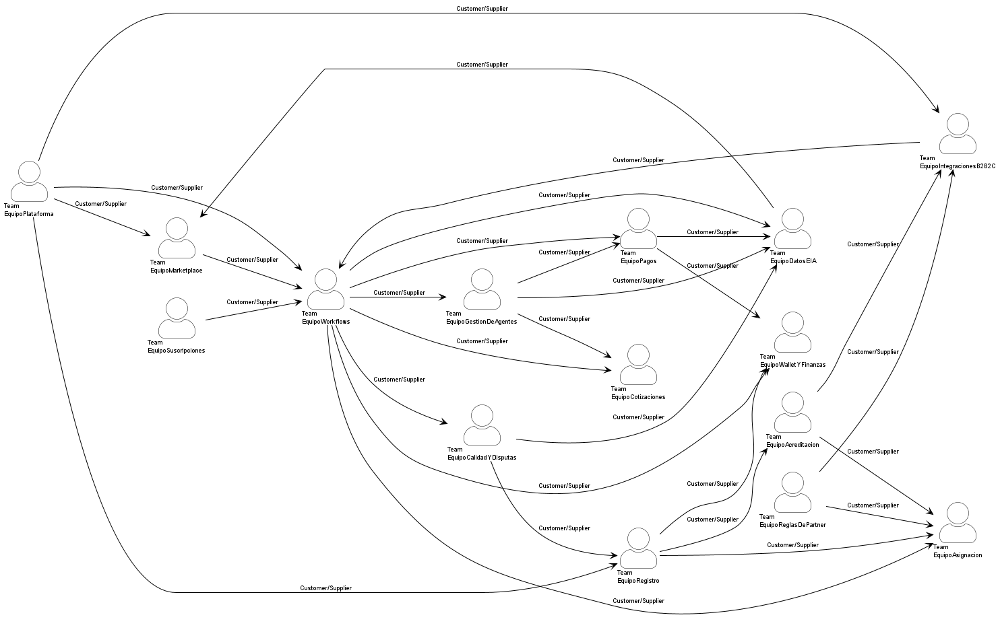

# Contextos acotados TO-BE

## 1. Cómo se diseñó el TO-BE y por qué

El TO-BE parte directamente de los once anti-patrones diagnosticados en el AS-IS. Cada decisión de diseño tiene una contrapartida explícita en esa lista, de modo que el mapa no es una reorganización cosmética sino la resolución concreta de los problemas identificados.

| Principio TO-BE | Anti-patrón que resuelve |
|---|---|
| **Ownership único por contexto** — ningún Shared Kernel entre contextos TO-BE | #1 Big Ball of Mud (25 SK en malla) |
| **Identificador de correlación propio** al pasar de siniestro a trabajo | #2 Siniestro y Trabajo son el mismo objeto |
| **ACL en todas las fronteras con sistemas externos** | #3 Conformist sin ACL frente a 30+ partners |
| **Integración asíncrona con verificadores externos** | #4 Consulta manual que bloquea el expediente |
| **ReglasDePartner consolidado** — un único contexto y un único equipo | #5 Reglas duplicadas en dos módulos |
| **HomologacionDeProveedores separado de AcreditacionYElegibilidad** | #6 Acreditación HdA y homologación partner en el mismo expediente |
| **Modelos de lectura propios alimentados por eventos** | #7 Analítica sobre la base de datos operativa |
| **Consistencia eventual e idempotente** en pagos y cierre | #8 Consistencia fuerte en procesos largos |
| **Agentes como actores explícitos del modelo** | #9 Proceso que depende de intervención humana no modelada |
| **Contratos asíncronos y escalamiento localizado** por contexto | #10 Escalabilidad acoplada (siniestros puede crecer 4× en 48 h) |
| **Customer/Supplier con contratos versionados** — cero Partnerships forzados | #11 13 Partnerships forzados; releases bloqueados |

---

## 2. Contextos acotados identificados

### 2.1 Dominio Servicios para el hogar (11 contextos)

| # | Contexto | Descripción | Equipo dueño |
|---|---|---|---|
| 1 | **Marketplace** | Conecta la demanda de hogares con la oferta de proveedores mediante la solicitud y contratación de trabajos, operando como servicio independiente con canal web y móvil asistidos por IA. | Marketplace |
| 2 | **Datos e Inteligencia Artificial** | Proporciona modelos de diagnóstico, priorización y detección de fraude construidos sobre modelos de lectura propios alimentados por eventos, sin acceso al esquema operativo de otros contextos. | Datos e IA |
| 3 | **Gestión de Trabajos** | Único dueño del ciclo de vida del Trabajo. Publica eventos que desacoplan a los demás contextos sin compartir esquema con nadie. | Workflows |
| 4 | **Cotizaciones** | Gestiona propuestas de proveedores en su propio modelo, alimentado por eventos del bus, sin llave foránea al esquema del trabajo. | Cotizaciones |
| 5 | **Asignación** | Determina y publica la asignación de proveedores consultando APIs de tres contextos proveedores (Gestión de Proveedores, Acreditación y Elegibilidad, Reglas de Partner). | Asignación |
| 6 | **Gestión de Ejecución** | Coordina la ejecución y el seguimiento de trabajos con los agentes de gestión como actores explícitos del modelo, sin acceso directo al esquema del Trabajo. | Gestión de agentes |
| 7 | **Gestión de Proveedores** | Administra la red de profesionales y empresas. Expone API pública OHS/PL y actualiza reputación a partir de eventos de calidad. | Registro |
| 8 | **Acreditación y Elegibilidad** | Gestiona la verificación y acreditación interna de proveedores según los criterios de HdA, separado de las homologaciones de partners. Integración asíncrona con ACL hacia sistemas externos. | Acreditación |
| 9 | **Reglas de Partner** | Dueño único de las reglas comerciales y operativas de todos los partners (consolidado desde el AS-IS donde estaban duplicadas). Expone API OHS/PL. | Reglas de Partner |
| 10 | **Calidad, Garantías y Disputas** | Gestiona calificaciones, garantías y disputas en su propio contexto. Publica evento CalificacionRegistrada para que Gestión de Proveedores actualice reputación. | Calidad y disputas |
| 11 | **Pagos y Liquidaciones** | Gestiona pagos y liquidaciones con consistencia eventual e idempotente, sin transacción distribuida con Gestión de Trabajos. Integra la pasarela de pagos de forma asíncrona con ACL. | Pagos |

### 2.2 Dominio Gestión de Siniestros y Pólizas (7 contextos)

*En el TO-BE, Reglas de Partner para Siniestros se fusiona con Reglas de Partner, reduciendo de 8 a 7 contextos en este dominio.*

| # | Contexto | Descripción | Equipo dueño |
|---|---|---|---|
| 12 | **Gestión de Siniestros** | Gestiona el ciclo de vida del siniestro desde su recepción. ACL de entrada que traduce el Published Language de HdA al agregado Siniestro, sin que el modelo externo entre crudo al dominio. | Integraciones B2B2C |
| 13 | **Gestión de Pólizas y Coberturas** | Determina las condiciones de cobertura aplicables. Expone API pública OHS/PL; Gestión de Siniestros la consume con ACL. | Integraciones B2B2C |
| 14 | **Evaluación y Aprobación de Siniestros** | Gestiona las decisiones de aprobación necesarias para iniciar la atención, operando con su propio modelo de decisiones alimentado por eventos. | Integraciones B2B2C |
| 15 | **Orquestación de Atención del Siniestro** | Coordina la transformación del siniestro aprobado en un Trabajo publicando un evento con ID de correlación propio, desacoplando completamente los dos dominios. | Integraciones B2B2C |
| 16 | **Homologación de Proveedores** | Determina qué proveedores están autorizados por cada partner para la atención de siniestros. Separado de la Acreditación interna de HdA. | Acreditación |
| 17 | **Gestión de Evidencias** | Gestiona la recopilación de evidencias en su propio repositorio. Publica evento EvidenciasCompletas para habilitar el cierre. | Gestión de agentes |
| 18 | **Cierre y Facturación de Siniestros** | Formaliza el cierre y genera los ítems facturables. Publica evento CierreDeSiniestroGenerado para que Pagos liquide de forma eventual. | Pagos |

### 2.3 Dominio Servicios Recurrentes del Hogar — nuevo (3 contextos)

| # | Contexto | Descripción | Equipo dueño |
|---|---|---|---|
| 19 | **Suscripciones** | Gestiona la contratación, renovación y cancelación de servicios recurrentes para el hogar. Publica evento SuscripcionActivada. | Suscripciones |
| 20 | **Planificación Recurrente** | Genera calendarios de ejecución periódica en respuesta a eventos de Suscripciones. Publica evento ServicioProgramado por cada ocurrencia. | Suscripciones |
| 21 | **Gestión de Servicios Periódicos** | Coordina la ejecución de cada ocurrencia (limpieza, jardinería, asistencia doméstica). Publica evento ServicioPeriodicoListo para que Gestión de Trabajos cree el Trabajo. | Suscripciones |

### 2.4 Dominio Servicios Financieros para Proveedores — nuevo (3 contextos)

| # | Contexto | Descripción | Equipo dueño |
|---|---|---|---|
| 22 | **Wallet de Proveedores** | Gestiona fondos de proveedores. Se activa cuando el proveedor supera el umbral de onboarding y acredita liquidaciones de forma eventual. | Wallet y Finanzas |
| 23 | **Scoring y Micropréstamos** | Construye el historial operacional del proveedor a partir de eventos de trabajos completados y calcula el score crediticio. | Wallet y Finanzas |
| 24 | **Servicios Financieros y Pagos** | Gestiona productos financieros para proveedores habilitados por la combinación de wallet y score. | Wallet y Finanzas |

### 2.5 Sistemas externos (5) — ahora con ACL

Los mismos sistemas del AS-IS, pero ninguno entra crudo al dominio. En el TO-BE, HdA define un Published Language REST que los partners deben seguir (invirtiendo el Conformist del AS-IS), y las integraciones con sistemas de verificación son asíncronas con ACL.

| Sistema | Cambio respecto al AS-IS |
|---|---|
| **Sistemas de Partner** | Los partners consumen el PL REST de HdA; GestionDeSiniestros y ReglasDePartner tienen ACL de entrada que traduce el payload externo al modelo de dominio |
| **Sistema de Antecedentes Judiciales** | Integración asíncrona con ACL; elimina la consulta manual que bloqueaba el expediente |
| **Registro Mercantil** | Integración asíncrona con ACL; elimina la consulta manual en el portal de Cámara de Comercio |
| **Entidades Certificadoras** | Integración asíncrona asistida por IA con ACL; elimina los bloqueos de 24-48 horas |
| **Pasarela de Pagos** | SDK invocado de forma asíncrona fuera de la transacción de negocio; ACL aísla los códigos de estado de la pasarela del modelo de dominio |

---

## 3. Relaciones y tipos de integración

Se identificaron **40 relaciones**. El cambio más importante respecto al AS-IS es la eliminación total de los Shared Kernels internos y la sustitución de los Conformist por ACL.

| Patrón | AS-IS | TO-BE | Qué significa |
|---|---|---|---|
| Shared Kernel | 25 | **0** | No existe modelo compartido entre contextos HdA |
| Customer/Supplier OHS/PL → ACL | 0 | **32** | Contrato versionado + capa de protección en el consumidor |
| Conformist | 6 | **0** | Reemplazado por ACL o por inversión del Published Language |
| Customer → ACL (sistemas externos) | 0 | **6** | Todos los sistemas externos protegidos con ACL |
| Partnership | 0 | **0** | Ningún equipo está obligado a coordinar releases |

### 3.1 Relaciones Customer/Supplier con OHS/PL → ACL (32)

Cada contexto upstream publica un contrato versionado (Published Language o evento con schema); el downstream protege su modelo con ACL. Ninguno comparte esquema de base de datos.

| Upstream (Supplier) | Downstream (Customer) | Mecanismo |
|---|---|---|
| Datos e Inteligencia Artificial | Marketplace | API REST versionada del modelo de diagnóstico |
| Marketplace | Gestión de Trabajos | Evento SolicitudDeTrabajoCreada en el bus |
| Gestión de Trabajos | Cotizaciones | Evento SubTrabajoPublicado en el bus |
| Gestión de Trabajos | Asignación | Evento SubTrabajoListoParaAsignacion en el bus |
| Gestión de Trabajos | Gestión de Ejecución | Evento ProveedorAsignado en el bus |
| Gestión de Trabajos | Pagos y Liquidaciones | Evento TrabajoCerrado en el bus |
| Gestión de Trabajos | Calidad, Garantías y Disputas | Evento TrabajoCerrado en el bus |
| Gestión de Trabajos | Datos e Inteligencia Artificial | Feed de eventos de trabajos |
| Gestión de Trabajos | Scoring y Micropréstamos | Feed de eventos de trabajos completados |
| Gestión de Ejecución | Cotizaciones | Evento NovedadRegistrada en el bus |
| Gestión de Ejecución | Datos e Inteligencia Artificial | Feed de eventos de ejecución |
| Gestión de Ejecución | Gestión de Evidencias | Evento HitoDeEjecucionRegistrado en el bus |
| Gestión de Proveedores | Asignación | API OHS/PL de perfiles de proveedor |
| Gestión de Proveedores | Homologación de Proveedores | API OHS/PL de perfil de proveedor |
| Gestión de Proveedores | Wallet de Proveedores | API OHS/PL de proveedor verificado |
| Acreditación y Elegibilidad | Asignación | API OHS/PL de estados de elegibilidad |
| Reglas de Partner | Asignación | API OHS/PL de redes permitidas por partner |
| Reglas de Partner | Orquestación de Atención del Siniestro | API OHS/PL de reglas del partner |
| Calidad, Garantías y Disputas | Gestión de Proveedores | Evento CalificacionRegistrada en el bus |
| Calidad, Garantías y Disputas | Datos e Inteligencia Artificial | Feed de eventos de calidad y disputas |
| Pagos y Liquidaciones | Datos e Inteligencia Artificial | Feed de eventos de pagos |
| Pagos y Liquidaciones | Wallet de Proveedores | Evento LiquidacionCompletada en el bus |
| Gestión de Pólizas y Coberturas | Gestión de Siniestros | API OHS/PL de coberturas |
| Gestión de Siniestros | Evaluación y Aprobación de Siniestros | Evento SiniestroRegistrado en el bus |
| Evaluación y Aprobación | Orquestación de Atención del Siniestro | Evento SiniestroAprobado en el bus |
| Homologación de Proveedores | Orquestación de Atención del Siniestro | API OHS/PL de red homologada |
| Orquestación de Atención del Siniestro | Gestión de Trabajos | Evento SiniestroListoParaAtencion (con ID de correlación propio) |
| Gestión de Evidencias | Cierre y Facturación de Siniestros | Evento EvidenciasCompletas en el bus |
| Cierre y Facturación de Siniestros | Pagos y Liquidaciones | Evento CierreDeSiniestroGenerado en el bus |
| Suscripciones | Planificación Recurrente | Evento SuscripcionActivada en el bus |
| Planificación Recurrente | Gestión de Servicios Periódicos | Evento ServicioProgramado en el bus |
| Gestión de Servicios Periódicos | Gestión de Trabajos | Evento ServicioPeriodicoListo en el bus |
| Wallet de Proveedores | Servicios Financieros y Pagos | API OHS/PL de wallet |
| Scoring y Micropréstamos | Servicios Financieros y Pagos | API OHS/PL de scoring |

### 3.2 Sistemas externos → ACL (6)

| Upstream (externo) | Downstream HdA | Mecanismo |
|---|---|---|
| Sistemas de Partner | Gestión de Siniestros | PL REST de HdA + ACL de entrada |
| Sistemas de Partner | Reglas de Partner | API de onboarding HdA + ACL de entrada |
| Sistema de Antecedentes Judiciales | Acreditación y Elegibilidad | Integración asíncrona + ACL |
| Registro Mercantil | Acreditación y Elegibilidad | Integración asíncrona + ACL |
| Entidades Certificadoras | Acreditación y Elegibilidad | Integración asíncrona asistida por IA + ACL |
| Pasarela de Pagos | Pagos y Liquidaciones | SDK asíncrono fuera de TX + ACL |

---

## 4. Relación entre equipos

En el TO-BE los 13 Partnerships forzados del AS-IS se eliminan completamente. Cada equipo puede liberar de forma independiente porque sus dependencias son contratos explícitos (eventos con schema o APIs versionadas).

| Equipo | Contextos | Relación principal |
|---|---|---|
| **Marketplace** | Marketplace | Customer de DatosEIA; Supplier de Workflows |
| **Datos e IA** | Datos e Inteligencia Artificial | Supplier de Marketplace; Customer de Workflows, Ejecución, Calidad y Pagos |
| **Workflows** | Gestión de Trabajos | Supplier central del 70 % de los contextos; Customer de Marketplace, IntegracionesB2B2C y Suscripciones |
| **Cotizaciones** | Cotizaciones | Customer de Workflows y Ejecución |
| **Asignación** | Asignación | Customer de Workflows, Registro, Acreditación y ReglasDePartner |
| **Gestión de agentes** | Gestión de Ejecución · Gestión de Evidencias | Customer de Workflows; Supplier de Cotizaciones, DatosEIA y Pagos |
| **Registro** | Gestión de Proveedores | Supplier de Asignación, Acreditación y WalletYFinanzas; Customer de CalidadYDisputas |
| **Acreditación** | Acreditación y Elegibilidad · Homologación de Proveedores | Supplier de Asignación e IntegracionesB2B2C; Customer de Registro |
| **Reglas de Partner** | Reglas de Partner (consolidado) | Supplier de Asignación e IntegracionesB2B2C |
| **Integraciones B2B2C** | Gestión de Siniestros · Gestión de Pólizas · Evaluación · Orquestación | Supplier de Workflows; Customer de ReglasDePartner y Acreditación |
| **Calidad y disputas** | Calidad, Garantías y Disputas | Supplier de Registro y DatosEIA |
| **Pagos** | Pagos y Liquidaciones · Cierre y Facturación de Siniestros | Customer de Workflows y GestionDeAgentes; Supplier de DatosEIA y WalletYFinanzas |
| **Suscripciones** | Suscripciones · Planificación Recurrente · Gestión de Servicios Periódicos | Supplier de Workflows |
| **Wallet y Finanzas** | Wallet de Proveedores · Scoring y Micropréstamos · Servicios Financieros y Pagos | Customer de Workflows, Registro y Pagos |
| **Plataforma** | Infraestructura transversal | Supplier de todos los equipos (bus de eventos, identidad, notificaciones) |



*Figura 3. Generada con ContextMapper CLI 6.12.0 a partir de `031-team-map-to-be.cml`.*

**Hallazgo principal: de 13 Partnerships forzados a 0.** Ningún equipo está obligado a coordinar su release con otro. Las dependencias son contratos explícitos y versionados. Esto permite que el equipo de ingeniería se duplique de 50 a 100 personas añadiendo capacidad de entrega en lugar de multiplicar el costo de coordinación.

**Hallazgo secundario: Workflows sigue siendo central, pero con contratos.** Gestión de Trabajos participa en más relaciones que cualquier otro contexto, pero ahora como Supplier con API versionada. Los consumidores pueden evolucionar independientemente siempre que Workflows respete los contratos publicados.

---

## 5. Trazabilidad: anti-patrón AS-IS → resolución TO-BE

| Anti-patrón AS-IS | Resolución TO-BE | Contexto(s) afectado(s) |
|---|---|---|
| #1 SK en malla (25 relaciones) | Ownership único + eventos + APIs OHS/PL con ACL | Todos los contextos internos |
| #2 Siniestro y Trabajo son el mismo objeto | Evento SiniestroListoParaAtencion con ID de correlación propio | OrquestacionDeAtencion → GestionDeTrabajos |
| #3 Conformist sin ACL (30+ partners) | ACL de entrada + Published Language REST de HdA | GestionDeSiniestros · ReglasDePartner |
| #4 Integración manual con verificadores (24-48 h) | Integración asíncrona con ACL + asistencia de IA | AcreditacionYElegibilidad |
| #5 Reglas de partner duplicadas | ReglasDePartner consolidado — único dueño del acuerdo | ReglasDePartner (fusiona ReglasDePartnerParaSiniestros) |
| #6 Acreditación HdA + homologación partner en el mismo expediente | HomologacionDeProveedores separado de AcreditacionYElegibilidad | HomologacionDeProveedores · AcreditacionYElegibilidad |
| #7 Analítica sobre base de datos operativa | Modelos de lectura propios alimentados por eventos | DatosEInteligenciaArtificial · ScoringYMicroprestamos |
| #8 Consistencia fuerte en procesos largos | Consistencia eventual e idempotente + compensación explícita | PagosYLiquidaciones · CierreYFacturacionDeSiniestros |
| #9 Intervención humana no modelada | Agentes como actores explícitos del modelo | GestionDeEjecucion |
| #10 Escalabilidad acoplada | Contratos asíncronos + escalamiento localizado por contexto | Todos los contextos (bus de eventos desacopla el despliegue) |
| #11 13 Partnerships forzados | Customer/Supplier con contratos versionados — 0 Partnerships | Vista organizacional TO-BE |

---

## 6. Reproducibilidad

```bash
cm validate -i models/03-context-map-to-be.cml
cm validate -i models/031-team-map-to-be.cml
cm generate -i models/03-context-map-to-be.cml  -g context-map -o ./gen
cm generate -i models/031-team-map-to-be.cml    -g context-map -o ./gen
```

> **Nota sobre el modelo multi-archivo:** Los archivos AS-IS y TO-BE declaran los mismos nombres de `BoundedContext`. En un proyecto ContextMapper con todos los archivos en el mismo classpath se generaría un conflicto de nombres duplicados. La solución de producción es factorizar todas las declaraciones de `BoundedContext` a un archivo compartido (ej. `00-bounded-contexts.cml`) y referenciarlos desde los ContextMaps AS-IS y TO-BE. Para los efectos de esta entrega, cada archivo se valida de forma independiente.
